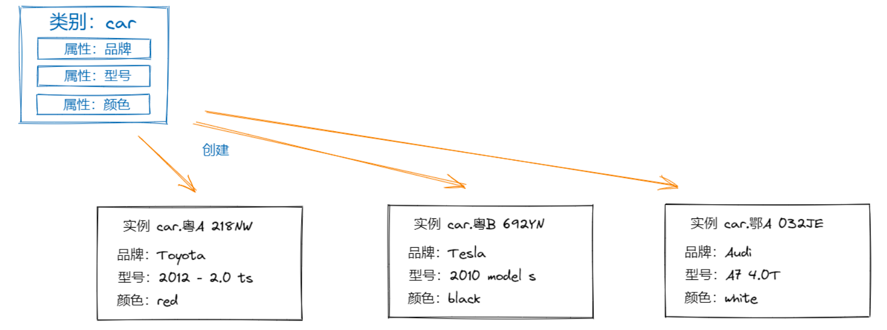
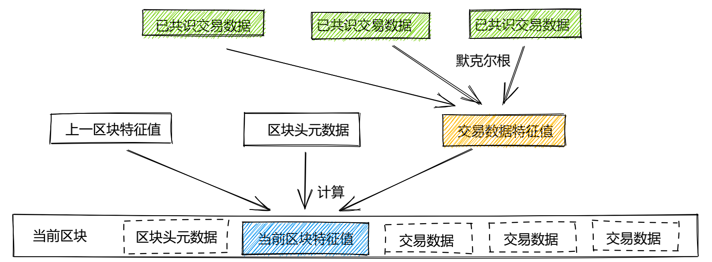

# paimon-sdk-java

欢迎使用 Paimon SDK for Java 。

Paimon SDK for Java 提供的功能操作接口进行了一层封装，让您不用复杂编程即可访问 Paimon 区块链各项能力，SDK可以自动帮您满足能力调用过程中所需的证书校验、加签、验签、发送HTTP请求等非功能性要求及提供了包括对资产类型（schema，也称文档类型，相当于表结构）、资产（document，也称文档，相当于表中的一条数据）、智能合约（contract）等功能性方法调用。

这里向您介绍如何获取 Paimon SDK for Java 并开始调用。

## 句词解释
- 数据域（Domain）：Paimon 的链上数据可以划分为叫做数据域的逻辑分区，域和域之间数据相互隔离，互不影响，链构建完
  成时会自动创建默认数据域 system，所有数据类别和资产都默认创建在 system 域。目前不支持自定义数据域，所以当前的所有资产都在 system 域。
- 数字资产：Paimon 是以数字资产为核心的分布式账本系统。Paimon 中的数字资产，<b><font color=red>是一个由文档内容、变更记录、数字签名共同构成，不可替代、不可篡改、可操作、可流转的最小数据单元。</font></b>
- 资产类别（Schema）：每个数字资产都归属于一个资产类别（Schema），类别使用名称标识。资产类别定义资产必须拥有的属性清单，属性清单包括：name（属性名称）、type（属性的值类型）、indexed（是否索引）。<b><font color=red>某种意义上可以类比数据库的一个表、表的定义、表字段的定义，如表名、表字段及字段的定义</font></b>
  
- 资产实例（Document）:创建数字资产时，指定归属类别和文档内容，就会创建一个全新的数字资产实例，也称为文档 （Document）。 每个实例使用"类别名.文档ID"进行标识，每个类别下文档ID都是唯一的，文档ID可以由创建者指定，如果不指定，则由系统生成唯一ID。 对用户和开发者来说，资产实例跟JSON文档一样读取，也能直接修改内容或者变更特定属性的值。<b><font color=red>某种意义上可以类比数据库的里的一条记录，因此在 Paimon 如果要操作资产实例要先定义资产类别，即先有表再有表的记录</font></b>
- 交易：Paimon 的交易由数字资产变更驱动，交易数据包含资产变更时间、发起者、世界状态版本、变更涉及的 读写结果集等内容。
- 区块：Paimon会选择一定数量已达成共识的交易数据，加上上一区块特征值，再连同发起者、创建时间等标准元数据，构建区块内容，并且背书签名。
  
- 智能合约（Contract）：智能合约通俗讲是一段写在区块链上的代码，一旦某个事件触发合约中的条款，代码即自动执行。也就是说，满足条件就执行，不需要人为操控。智能合约的主要目的是通过去除传统业务流程中涉及的中介来简化各方之间的业务交易。这些合同旨在在不影响真实性和可信度的情况下减少付款延迟、错误风险和传统合同的复杂性。

<b>详细解释请参考： [Paimon 快速入门手册.pdf](./doc/Paimon 快速入门手册.pdf)</b>

## 环境要求

1. Paimon SDK for Java 需要配合`JKD 1.8`或其以上版本。
2. 使用 Paimon SDK for Java 之前 ，您需要先获取 Paimon 的“链应用”接入的权限及其访问令牌。 
3. 准备工作完成后，注意保存如下信息，后续将作为使用 SDK 的输入。
 - `Paimon 网关地址`、`令牌 ID`、`令牌私钥`

## 安装依赖
如果通过 `Maven` 来管理项目依赖，需要在项目的 `pom.xml` 文件中声明如下依赖
```xml
<dependency>
    <groupId>com.dreamkey.paimon</groupId>
    <artifactId>paimon-sdk-java</artifactId>
    <version>1.0.0</version>
</dependency>
```

如果通过 `Gradle` 管理项目依赖，需要在 `build.gradle` 文件中声明如下依赖
```properties
implementation("com.dreamkey.paimon:paimon-sdk-java:1.0.0")
```


## 接口/方法说明
### 资产类型（Schema）相关操作
`com.dreamkey.paimon.client.SchemaClient` 负责资产类型的相关操作

### 资产实例（Document）相关操作
`com.dreamkey.paimon.client.DocumentClient` 负责资产实例的相关操作

### 区块（Block）相关操作
`com.dreamkey.paimon.client.BlockClient` 负责区块的相关操作

### 系统基本信息（SystemInfo）相关操作
`com.dreamkey.paimon.client.SystemInfoClient` 负责系统基本信息的相关操作

<b>接口具体描述请查看 [Paimon sdk 接口说明.xlsx](doc/Paimon sdk 接口说明.xlsx)</b>

## 使用说明

### 注意事项
- 对于资产实例的删除，只是标识为删除，并不会删除区块。
- Paimon 创建的 Schema 中的字段不能传 null，所以添加实例（Document）时，如果某些字段为空，要传入空字符串 ""。
- 创建 Schema 、添加 Document 等操作，传入对象或者对象的 Class 是通过反射的方式获取对应的 Schema name 和 Schema 属性清单。
- 添加 Document 时，如果没有指定 documentId 那么由 Paimon 生成。以对象或者对象 Class 方式反射的时候，如果声明了某个字段为 @DocId 代表使用该字段作为 DocumentId。

### 简单描述（以单元测试为例）
以 `Maven` 管理依赖为例，项目的 `pom.xml` 添加 `paimon-sdk-java` 依赖包

1. 实体类封装需要上链的数据：

```java
@Data
public class User {
    @DocId
    @Property(type = PropertyType.STRING, indexed = true)
    private String userId;

    @Property(type = PropertyType.STRING)
    private String name;

    @Property(type = PropertyType.STRING)
    private String sex;

    @Property(type = PropertyType.INT)
    private Integer age;

    @Property(type = PropertyType.BOOL)
    private Boolean marry;
}
```

2. 配置 Paimon 连接信息
``` java
    public PaimonConfig config = new PaimonConfig("system","192.168.1.84:9100", "c91d3bv29928uoh6a5h0", "6cae6cb76ed7a9c8b1e724d29c5c4744f1d135719096de676c6a7d2ff128a4abcdd1a0a8c99c1a8ebd7fd87fcdc7a42d57163cf17154e7c8319e397821bc5dbf");

```

3. 创建资产类型（schema）：

```java
@Test
public void addUserSchemaTest() throws IOException {
	SchemaClient schemaApi = new SchemaClient(config);
    String schemaName = schemaClient.addSchema(User.class);
    System.out.println(schemaName);
}
```

4. 添加资产实例（document）：

```java
@Test
public void addUserTest() throws IOException, IllegalAccessException {
	user.setUserId(IdWorker.getIdStr());
	DDocumentClient documentClient = new DocumentClient(config);
	String userId = documentApi.addDocument(user);
	System.out.println(userId);
}
```

5. 获取资产详情：

```java
@Test
public void getUserTest() throws IOException {
    DocumentClient documentClient = new DocumentClient(config);
    User user = documentClient.getDocument("1506898363680686081", User.class);
    System.out.println(user);
}
```


### DEMO
[Paimon SDK for Java](https://gitee.com/umeclub/paimon-sdk-demo.git) 源码地址

## 变更日志
每个版本的详细更改记录在[变更日志](./CHANGELOG)中。

